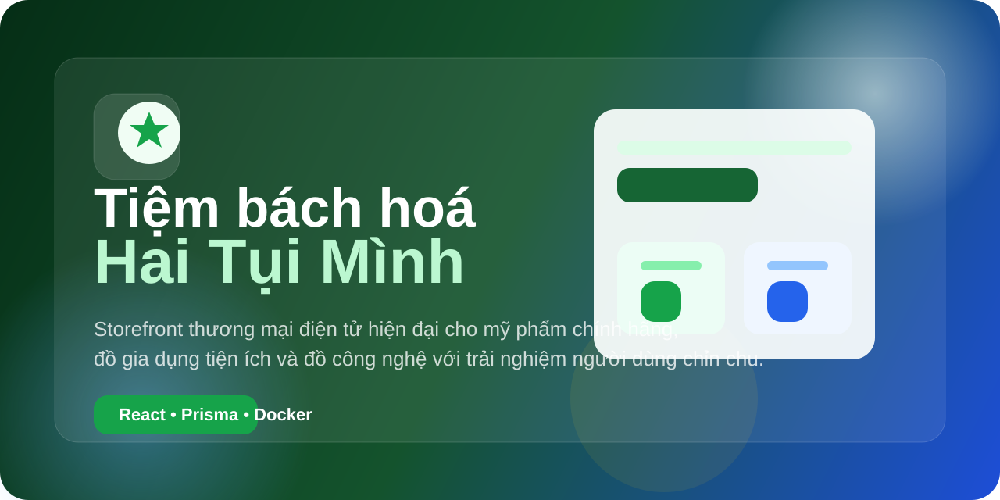

<p align="center">
  
</p>

<p align="center">
  
</p>

<h1 align="center">Tiệm bách hoá Hai Tụi Mình</h1>

<p align="center">
  Nền tảng thương mại điện tử hiện đại dành cho mỹ phẩm chính hãng, đồ gia dụng tiện ích và sản phẩm công nghệ, được xây dựng với định hướng trải nghiệm mua sắm mượt mà, giao diện chỉn chu và kiến trúc đủ vững để tiếp tục mở rộng trong thực tế.
</p>

<p align="center">
  
  
  
  
  
</p>

## Giới thiệu
`Tiệm bách hoá Hai Tụi Mình` là dự án storefront full-stack được phát triển cho mô hình bán hàng trực tuyến tập trung vào ba nhóm sản phẩm:

- Mỹ phẩm chính hãng
- Đồ gia dụng tiện ích
- Đồ công nghệ và phụ kiện công nghệ

Ứng dụng được thiết kế để mang lại cảm giác mua sắm hiện đại với luồng khám phá sản phẩm rõ ràng, chi tiết sản phẩm giàu thông tin, hệ thống tài khoản nhiều tính năng và nền tảng backend sẵn sàng cho các pha mở rộng tiếp theo.

## Mục tiêu sản phẩm
- Xây dựng website bán hàng chính hãng với định vị rõ ràng và trải nghiệm nhất quán
- Tối ưu hành trình mua sắm từ khám phá, xem sản phẩm, thêm giỏ đến thanh toán
- Hoàn thiện trung tâm tài khoản khách hàng với loyalty, wishlist, lịch sử xem và quản lý thông tin cá nhân
- Tạo nền tảng kỹ thuật đủ chắc cho vận hành, quản trị và phát triển tính năng về sau

## Phạm vi tính năng hiện có
### Storefront
- Trang chủ với khối giới thiệu thương hiệu, danh mục nổi bật và các cụm khuyến mãi
- Bộ sưu tập và trang khám phá sản phẩm
- Tìm kiếm sản phẩm theo từ khóa
- Bộ lọc theo danh mục, mức giá, đánh giá
- Phân trang danh sách sản phẩm

### Product experience
- Product card với trạng thái yêu thích, thêm giỏ hàng và badge sản phẩm
- Trang chi tiết sản phẩm với:
  - gallery hình ảnh
  - variant selector
  - sticky CTA
  - hiển thị đánh giá, tồn kho, số lượng đã bán
  - recently viewed
- Dữ liệu sản phẩm được tổ chức qua `src/entities/product` với lớp `api`, `model`, `ui` tách biệt

### Commerce flow
- Giỏ hàng với store cục bộ
- Checkout nhiều bước
- Theo dõi đơn hàng
- Tóm tắt đơn hàng và xác minh thanh toán

### Account center
- Hồ sơ cá nhân
- Địa chỉ
- Bảo mật
- Cài đặt thông báo
- Wishlist
- Recently viewed
- Hạng thành viên và tích điểm

### Admin
- Quản trị sản phẩm
- Quản trị đơn hàng
- Quản trị khách hàng
- Dashboard và settings nền

## Kiến trúc kỹ thuật
### Frontend
- React 19
- TypeScript
- Vite
- React Router
- Zustand
- TanStack Query
- Tailwind CSS

### Backend
- Express
- Prisma ORM
- PostgreSQL
- Redis
- JWT authentication

### Testing
- Vitest
- Playwright

## Cấu trúc thư mục
- `src/app`: app shell, routes, providers
- `src/pages`: các trang chính của ứng dụng
- `src/entities`: business entities, types, API clients, UI blocks cấp domain
- `src/features`: logic theo flow tính năng
- `src/widgets`: các khối giao diện lớn như header, footer, cart drawer
- `src/server`: routers, middleware, backend services
- `prisma`: schema, migration, seed
- `tracking`: tiến độ phát triển theo phase

## Điểm nhấn triển khai
- App shell dùng chung giữa các route storefront và `/profile`
- Dark mode và theme hydration đã được harden để tránh flash giao diện trắng
- Product module có phân tách rõ giữa danh sách sản phẩm, product detail và trạng thái cá nhân hóa như wishlist / recently viewed
- Hệ thống loyalty được nối vào account experience
- Backend có chuẩn hóa response và nền tảng admin router

## Chạy local
### Yêu cầu
- Node.js
- Docker Desktop

### Cài đặt
1. Cài dependencies:
   ```bash
   npm install
   ```

2. Tạo file môi trường:
   - Dự án đang dùng `.env`
   - Có thể tham khảo `.env.example`

3. Khởi động database và cache:
   ```bash
   npm run docker:up
   ```

4. Đồng bộ Prisma:
   ```bash
   npm run db:push
   npm run db:generate
   ```

5. Chạy ứng dụng:
   ```bash
   npm run dev
   ```

6. Truy cập:
   ```text
   http://localhost:3000
   ```

## Biến môi trường chính
- `PORT`
- `DATABASE_URL`
- `REDIS_URL`
- `JWT_SECRET`
- `NEXT_PUBLIC_API_URL`

Chi tiết tham khảo tại [`.env.example`](./.env.example).

## Deployment guide
### Quy trình cơ bản
1. Build frontend:
   ```bash
   npm run build
   ```
2. Chạy `server.ts` ở môi trường production
3. Cấu hình reverse proxy qua Nginx hoặc nền tảng cloud tương đương

### Hạ tầng khuyến nghị
- Application server: VPS, Railway, Render hoặc Docker host
- Database: PostgreSQL managed service hoặc container riêng
- Cache: Redis managed service hoặc container riêng

### Lưu ý production
- Thiết lập `JWT_SECRET` đủ mạnh
- Không sử dụng database dev cho production
- Tách rõ cấu hình môi trường development / staging / production
- Thiết lập backup cho database và logging cho backend

## Roadmap ngắn
- [x] Hoàn thiện storefront nền tảng, checkout, order tracking và account center
- [x] Tích hợp backend Express, Prisma, PostgreSQL và admin router
- [x] Hoàn thiện shell/layout persistence cho profile
- [ ] Ổn định media storage cho avatar và tài nguyên sản phẩm
- [ ] Hoàn thiện chatbot hỗ trợ cá nhân hóa
- [ ] Mở rộng social commerce và community engine

## Contributor
Dự án hiện được phát triển như một storefront độc lập với định hướng có thể tiếp tục mở rộng theo nhóm ở các mảng:

- Frontend commerce UX
- Backend API và data layer
- Admin / operations
- QA / automation

## License
Hiện chưa phát hành dưới license public chính thức. Có thể giữ ở trạng thái `All rights reserved` hoặc bổ sung MIT khi dự án sẵn sàng open-source.

## Ghi chú
- Dự án dùng backend Express chạy cùng frontend Vite
- Prisma kết nối PostgreSQL qua Docker trong môi trường local
- Nếu Docker Desktop hoặc container engine gặp lỗi filesystem, backend auth và Prisma có thể không kết nối được database
