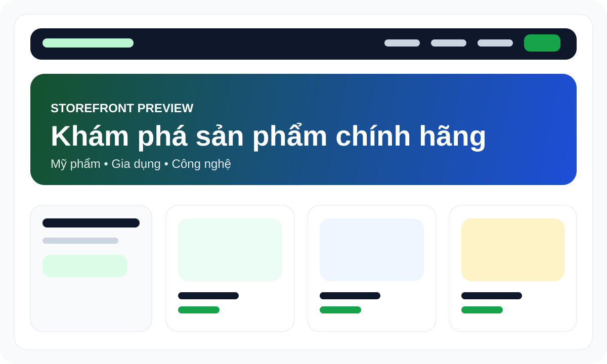

<p align="center">
  
</p>

<p align="center">
  
</p>

<h1 align="center">Tiệm bách hoá Hai Tụi Mình</h1>

<p align="center">
  Storefront thương mại điện tử hiện đại cho mỹ phẩm chính hãng, đồ gia dụng tiện ích và sản phẩm công nghệ với trải nghiệm người dùng được đầu tư để dùng thực tế và đủ chiều sâu để đưa vào CV/portfolio.
</p>

<p align="center">
  
  
  
  
  
</p>

## Tổng quan dự án
`Tiệm bách hoá Hai Tụi Mình` được xây dựng như một nền tảng bán hàng trực tuyến chuyên về:

- Mỹ phẩm chính hãng
- Đồ gia dụng tiện ích
- Đồ công nghệ và phụ kiện công nghệ

Dự án tập trung vào ba mục tiêu chính:

- Tạo trải nghiệm mua sắm chỉn chu trên cả desktop và mobile
- Hoàn thiện các flow thương mại cốt lõi như khám phá sản phẩm, giỏ hàng, thanh toán, tài khoản và loyalty
- Xây dựng nền tảng frontend + backend đủ chắc để tiếp tục mở rộng sang social commerce, community và vận hành thực tế

## Điểm nhấn chuyên môn
- Kiến trúc storefront tách lớp rõ giữa `entities`, `features`, `widgets`, `pages`
- App shell thống nhất với dark mode, theme hydration và route persistence
- Full-stack JavaScript/TypeScript với Express, Prisma, PostgreSQL, Redis
- Profile center nhiều tab: hồ sơ, địa chỉ, bảo mật, wishlist, recently viewed, membership
- Hạ tầng quản trị cơ bản cho sản phẩm, đơn hàng, khách hàng
- Có test nền cho shell/layout persistence và visual regression

## Preview giao diện
### Storefront
<p>
  
</p>

### Account Center
<p>
  
</p>

## Tính năng chính
- Trang chủ, bộ sưu tập và khám phá sản phẩm
- Tìm kiếm sản phẩm, lọc theo danh mục, giá, đánh giá và phân trang
- Chi tiết sản phẩm, wishlist, recently viewed
- Giỏ hàng và quy trình checkout nhiều bước
- Theo dõi đơn hàng và trạng thái giao hàng
- Tài khoản người dùng với hồ sơ, địa chỉ, bảo mật và cài đặt thông báo
- Loyalty system với điểm thưởng và hạng thành viên
- Khu vực quản trị cho sản phẩm, đơn hàng và khách hàng

## Công nghệ sử dụng
- React 19
- TypeScript
- Vite
- React Router
- Zustand
- TanStack Query
- Express
- Prisma
- PostgreSQL
- Redis
- Tailwind CSS
- Vitest
- Playwright

## Cấu trúc thư mục
- `src/app`: app shell, routes, providers
- `src/pages`: các trang chính
- `src/entities`: model, API client, business entities
- `src/features`: logic theo từng flow nghiệp vụ
- `src/widgets`: các khối UI lớn như header, footer, cart drawer
- `src/server`: routers, middleware, service backend
- `prisma`: schema, migrations, seed
- `tracking`: tiến độ phát triển theo phase

## Chạy local
### Yêu cầu
- Node.js
- Docker Desktop

### Các bước
1. Cài dependencies:
   ```bash
   npm install
   ```
2. Tạo file môi trường:
   - Dùng `.env`
   - Tham khảo `.env.example`
3. Khởi động PostgreSQL và Redis:
   ```bash
   npm run docker:up
   ```
4. Đồng bộ Prisma:
   ```bash
   npm run db:push
   npm run db:generate
   ```
5. Chạy app:
   ```bash
   npm run dev
   ```
6. Truy cập:
   ```text
   http://localhost:3000
   ```

## Deployment guide
### Frontend + backend cùng máy chủ
- Build frontend bằng:
  ```bash
  npm run build
  ```
- Chạy `server.ts` ở môi trường production
- Cấu hình reverse proxy qua Nginx hoặc nền tảng cloud tương đương

### Hạ tầng khuyến nghị
- Frontend/Node app: VPS, Railway, Render hoặc Docker host riêng
- Database: PostgreSQL managed hoặc container riêng
- Cache: Redis managed hoặc container riêng

### Lưu ý production
- Thiết lập `JWT_SECRET` đủ mạnh
- Không dùng SQLite/dev DB cho production
- Tách riêng biến môi trường theo môi trường triển khai
- Bật backup cho database và logging cho server

## Roadmap ngắn
- [x] Hoàn thiện storefront, checkout, tracking và account center
- [x] Hoàn thiện nền tảng auth, Prisma, PostgreSQL và admin router
- [x] Gắn app shell chung cho profile, dark mode và route persistence
- [ ] Hoàn thiện media/storage flow cho avatar và tài nguyên sản phẩm
- [ ] Bổ sung chatbot hỗ trợ cá nhân hóa
- [ ] Mở rộng social commerce và community engine

## Contributor
Hiện tại dự án được phát triển như một sản phẩm portfolio/commerce case study dành cho `Tiệm bách hoá Hai Tụi Mình`.

Nếu mở rộng theo nhóm, nên chia contributor theo các mảng:
- Frontend commerce UX
- Backend API & data layer
- Admin/operations
- QA & automation

## License
Hiện chưa gắn license public chính thức. Nếu dùng để trình bày CV/portfolio, có thể giữ ở trạng thái `All rights reserved` hoặc bổ sung MIT khi sẵn sàng open-source.

## Ghi chú
- Dự án hiện dùng backend Express chạy chung với frontend Vite
- Prisma kết nối PostgreSQL qua Docker
- Một số phase trong `tracking/` phản ánh tiến độ thực tế
- Nếu Docker Desktop gặp lỗi filesystem/container engine, backend auth và Prisma có thể không kết nối được database
